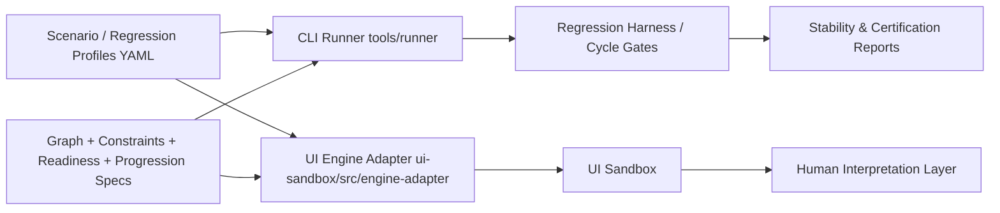
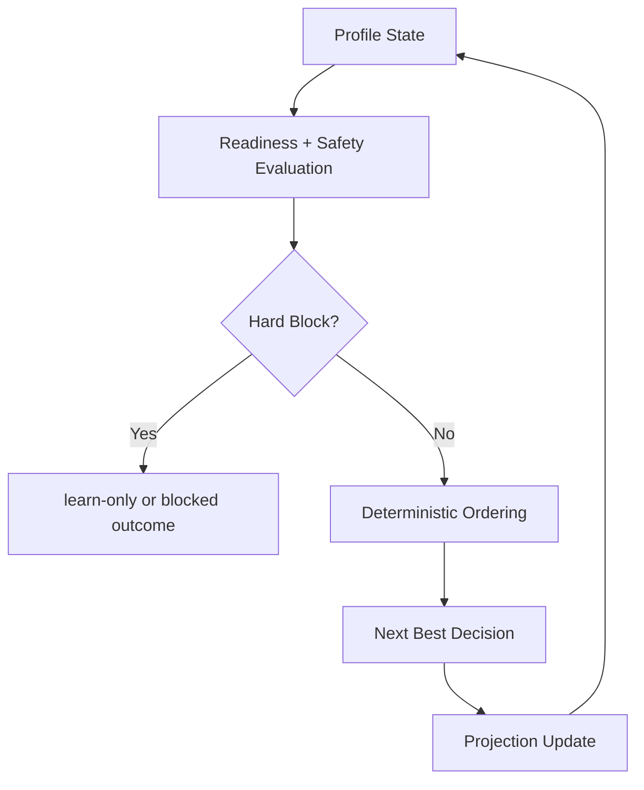

# Universal Decision Engine Architecture

## System Map

## Decision Flow

## Notes

- Engine specifications remain source-of-truth artifacts.
- CLI and UI consume deterministic outputs through a thin adapter layer.
- Regression harness gates every cycle before certification.
